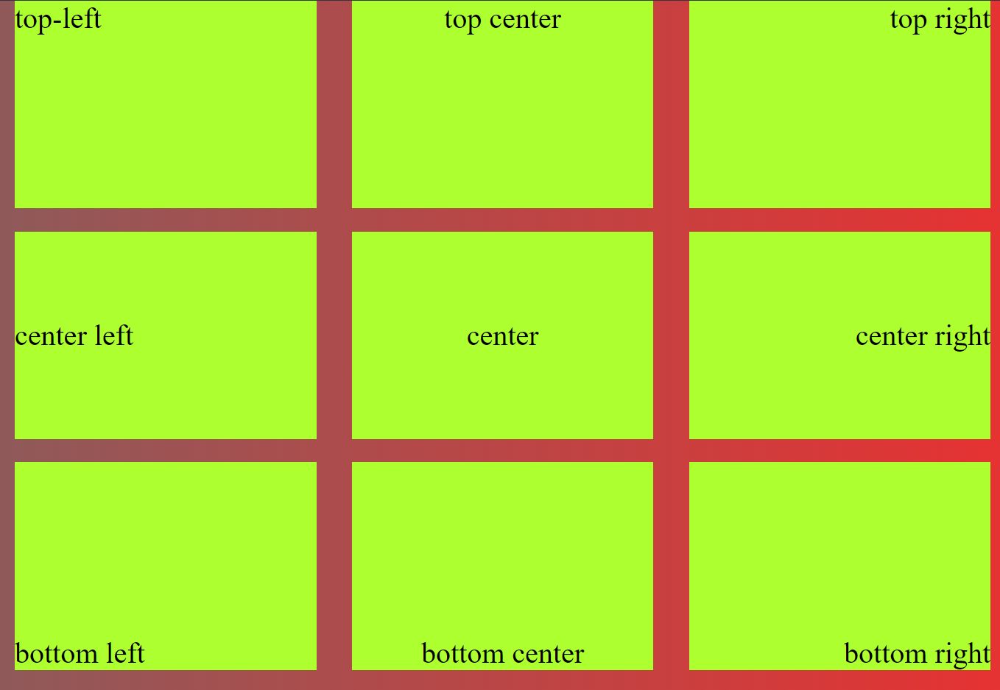

# Reto #1: CSS3 Flex

El siguiente reto fue propuesto por [Michael](github.com/michael-saeek) en el grupo de
desarrolladores Full Stack de Discord. La propuesta es la siguiente:

*"Utilizando únicamente Flexbox en CSS3, generar el siguiente arreglo"*

## Iniciando el proyecto

## Añadiendo estilos con CSS

## ¿Y ahora, cómo movemos el texto?
